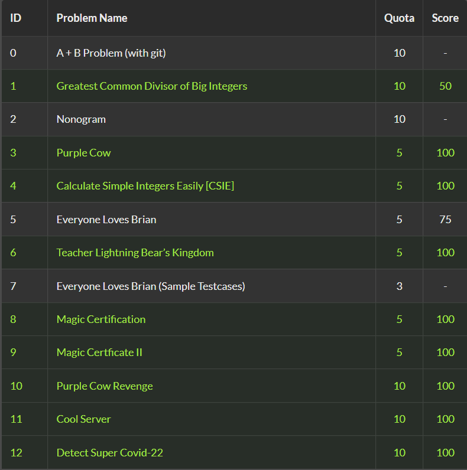

# NTUCSIE-2022-DSA-Assignments
NTUCSIE Data Structures and Algorithms

In this course, we learned bst, heap, treap, stacks, queue, graph...etc.

Also some other related topic, such as radix sort, bucket sort, KMP, Rabin-Karp.

We implement these data structures in C.

Scores:

The master branch is my work, while FC new branch is from my dad (he also found the course interesting)
